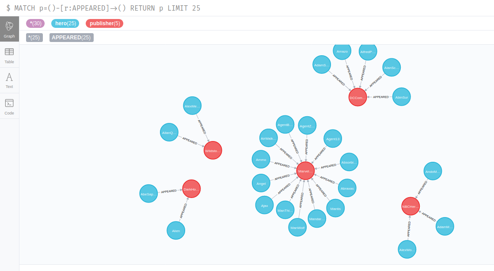

# DataScienceNeo4JMarvel

## Installation

```bash
pip3 install neo4j
pip3 install pandas
```

## Connection to the database
Change constants in the main.py

```python
URI = "bolt://localhost:7687"
USER = "neo4j"
PASSWORD = "test"
PATH_CSV = "heroes_information.csv"
```
## Lauch the python script
Launch the main python script

## Go to http://localhost:7474/browser/
Do this query in order to view which heros appear in publishers

```cypher
MATCH p=()-[r:RELTYPE]->() RETURN p
```




## export neo4j relationship in Gephi format 
[use this application ](https://github.com/olir/gephi-neo4j-url-importer-plugin?fbclid=IwAR3eJKsiPIas7omgotnhEkVhEj-2E6YY-uf9vwLsaFDb90HF9Z9wftK8A7E)
